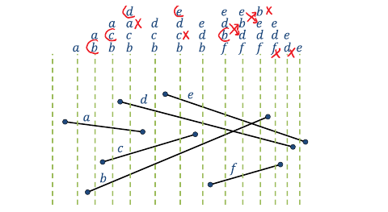

# Sweep Line Algorithm

## Overview

The sweep-line paradigm is a powerful algorithmic design technique, particularly useful for solving geometric problems but also applicable to other areas. This repository contains implementations of algorithms based on the sweep-line paradigm to solve problems involving intersecting collections of line segments in 2-D.

## Description

Generally, the sweep-line approach involves processing data in a specific order (e.g., left-to-right). During this process, a data structure is maintained to keep information gleaned from the data that lies to the left of the sweep line. As the sweep line moves across the plane, it absorbs new pieces of input and incorporates them into its data structure.

### Problem Statement

The main problem addressed by this repository is to compute all intersections of a set of line segments. The input is a set \( S \) of line segments in the plane, each defined by a pair of points. The output is a list of all the places where these line segments intersect.

### Algorithm

The basic steps of the sweep-line algorithm for computing all intersections of a set of line segments are as follows:

1. **Initialization**:
    - Create an empty priority queue (event queue, EQ).
    - Insert the start and end points of each segment into the EQ.
    - Create an empty balanced tree (active segment list, SL).

2. **Processing Events**:
    - While the EQ is not empty:
        - Extract the minimum element from the EQ (denoted as \( E \)).
        - Depending on the type of event \( E \):
            - If \( E \) is the start of a segment \( s \):
                - Insert \( s \) into SL.
                - Check for intersections between \( s \) and its successor in SL.
                - Check for intersections between \( s \) and its predecessor in SL.
            - If \( E \) is the end of a segment \( s \):
                - Check for intersections between the predecessor and successor of \( s \) in SL.
                - Remove \( s \) from SL.
            - If \( E \) is a crossing event between segments \( s1 \) and \( s2 \):
                - Report the intersection.
                - Swap \( s1 \) and \( s2 \) in SL.
                - Check for intersections between \( s1 \) and its new neighbor.
                - Check for intersections between \( s2 \) and its new neighbor.

### Performance

The algorithm operates in \( O((n + k) \log n) \) time, where \( n \) is the number of segments and \( k \) is the number of intersections. This efficiency is achieved through the use of balanced tree data structures and priority queues.

